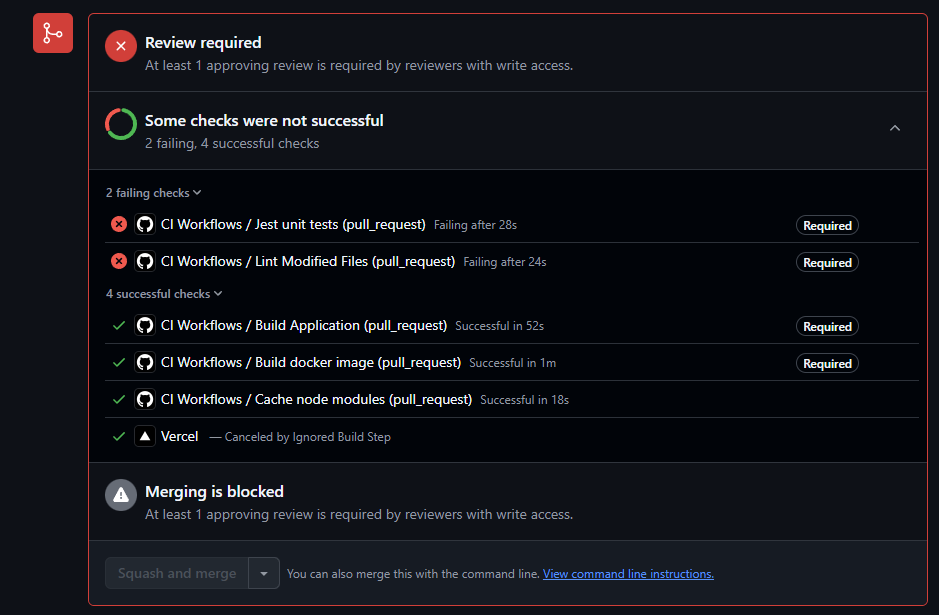

# 🎓 **University Frontend** 🌟

Welcome to the **University Management System** frontend! Built using **React** and **TypeScript**, this system offers a beautiful, intuitive, and powerful interface for managing student data, course registrations, and more. It also boasts solid testing with **Jest** and **Cypress** to ensure everything works flawlessly.


## 🚀 **Key Features**

- **⚡️ React with TypeScript**: Combining React's dynamic capabilities with TypeScript's type safety for a seamless developer experience.
- **🧩 Modular Architecture**: A component-based design that ensures maintainability and scalability as the app grows.
- **📦 Efficient State Management**: Effortlessly handles app state using tools like **Redux**, **Context API**, or others.
- **🔗 Smooth API Integration**: Easily communicates with your backend to handle data synchronization and fetching.
- **📱 Responsive Design**: A stunning and adaptive interface that looks great on all devices.
- **🔍 High Test Coverage**: The project includes robust testing using **Jest** and **Cypress** to ensure everything functions as expected. Here's the test coverage summary:


- **💡 Detailed Coverage**: All files in the project are thoroughly tested, including key files like **Auth.State.Slice.ts** and **View.State.Slice.ts**. Our code coverage is robust, with high uptime for line, function, and branch coverage across important files.


### ✅ **CI/CD Pipeline with GitHub Actions**

Our project leverages **GitHub Actions** for Continuous Integration (CI), ensuring a robust and streamlined workflow for code quality checks and test automation. Every pull request undergoes multiple checks, including unit tests, linting, and builds. Below is an example of the CI checks in action:



### **Key Features:**
- **Comprehensive Checks**: All pull requests must pass the CI checks before being eligible for merging.
- **Review Requirement**: At least one approving review is mandatory, ensuring high code quality and collaboration.
- **Merge Blocking**: Merging is blocked until all required checks are successful, as shown in the screenshot above.

This ensures that only well-tested, high-quality code is merged into the main branch. For more details, you can view the CI workflow in the [example pull request](https://github.com/Swiatlon/University-FN/pulls).


## 🛠️ **Getting Started**

### **Prerequisites**

Before you dive in, ensure you have the following installed:

- **Node.js**: Version **18.0.0** or higher 🌱
- **npm**: Version **8.0.0** or higher 🛠️

---

### **Installation Steps**

1. **Clone the Repository**:
   ```bash
   git clone https://github.com/Swiatlon/University-FN
   ```

2. **Navigate to Your Project Directory**:
   ```bash
   cd University-FN
   ```

3. **Install Dependencies**:
   ```bash
   npm install
   ```

---

### **Running the App**

- **💻 Development Mode**:
   Start the app with live reloads to enjoy the development experience!
   ```bash
   npm run dev
   ```

- **🚀 Production Build**:
   When you're ready to deploy, build the app for production:
   ```bash
   npm run build
   ```
   Your production-ready build will be in the `build` directory.

---

### **Running Tests**

- **Jest Tests**: Run unit and integration tests with Jest:
   ```bash
   npm run test
   ```

- **Cypress Tests**: Run end-to-end tests with Cypress:
   ```bash
   npm run cypress
   ```


## 🧩 **Docker Compose Setup**

### How to Use the `docker-compose.yml`

#### 1. Clone Repositories

Clone both **frontend** and **backend** repositories into the same parent directory:

```bash
git clone https://github.com/Swiatlon/University-FN University-FN
git clone https://github.com/Swiatlon/University-BN University-BN
```

#### 2. Organize Your Project

Ensure the parent directory contains both repositories and the `docker-compose.yml` file:

```
Parent Directory/
├── docker-compose.yml  # Unified orchestration file
├── University-FN/      # Frontend repository
└── University-BN/      # Backend repository
```

#### 3. Remove Individual Compose Files

If `docker-compose.yml` files exist in the `University-FN` or `University-BN` repositories, remove them to avoid conflicts.

#### 4. Generate Migrations (For Backend)

Before running the containers, make sure to generate and apply migrations for your backend database. Navigate to the backend directory and run the following commands:

- **Generate a migration (optional)**:
  ```bash
  cd University-BN
  npm run migration:generate <migration-name>
  ```

#### 5. Start Services

Run the following commands from the **parent directory**:

- **Start all services in development mode**:
  ```bash
  docker-compose --profile dev up --build
  ```

- **Start all services in production mode**:
  ```bash
  docker-compose --profile prod up --build
  ```

#### 6. Stop Services

Stop and clean up all services with:

```bash
docker-compose down
```


## 📝 **License**

This project is open-source and licensed under the **MIT License**. Check out the full details in the [LICENSE](LICENSE) file.


## 📬 **Contact**

If you have any questions or feedback, feel free to reach out:

- Email: [your email address] 📧
- Open an issue on [GitHub Issues](https://github.com/Swiatlon/University-FN/issues) 💬
